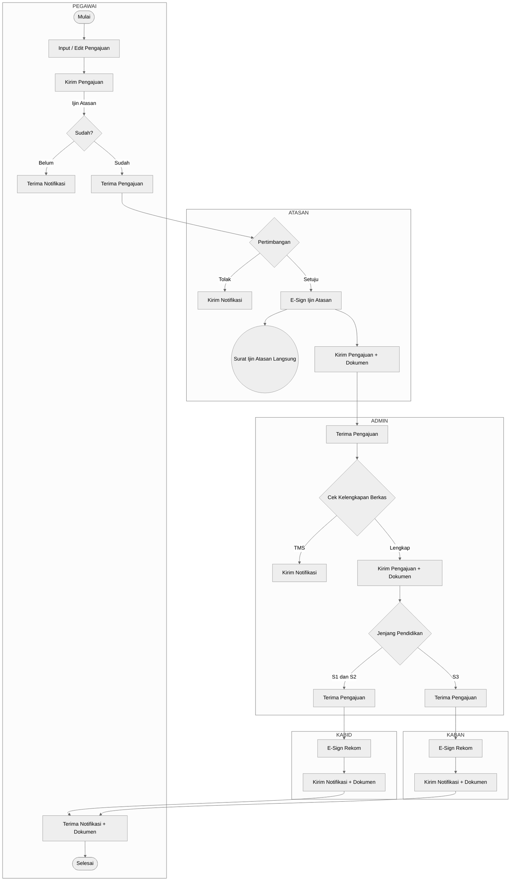

# Module Study Assign

```mermaid
%%{init: {'theme': 'neutral'}}%%
flowchart TD
    %% === Swimlanes (sebagai komentar) ===
    %% PEGAWAI
    subgraph PEGAWAI
        P1([Mulai]) --> P2[Input / Edit Pengajuan]
        P2 --> P3[Kirim Pengajuan]
        P3 -->|Ijin Atasan| D1{Sudah?}
        D1 -->|Belum| P4[Terima Notifikasi]
        D1 -->|Sudah| A1
    end

    %% ATASAN
    subgraph ATASAN
        A1[Terima Pengajuan]
        A1 --> D2{Pertimbangan}
        D2 -->|Tolak| A2[Kirim Notifikasi]
        D2 -->|Setuju| A3[E-Sign Ijin Atasan]
        A3 --> A4((Surat Ijin Atasan Langsung))
        A3 --> A5[Kirim Pengajuan + Dokumen]
    end

    %% ADMIN
    subgraph ADMIN
        A5 --> AD1[Terima Pengajuan]
        AD1 --> D3{Cek Kelengkapan Berkas}
        D3 -->|TMS| AD2[Kirim Notifikasi]
        D3 -->|Lengkap| AD3[Kirim Pengajuan + Dokumen]
        AD3 --> D4{Jenjang Pendidikan}
        D4 -->|S1 dan S2| KB1
        D4 -->|S3| KB2
    end

    %% KABID
    subgraph KABID
        KB1[Terima Pengajuan]
        KB1 --> KB2A[E-Sign Rekom]
        KB2A --> KB3[Kirim Notifikasi + Dokumen]
    end

    %% KABAN
    subgraph KABAN
        KB2[Terima Pengajuan]
        KB2 --> KB4[E-Sign Rekom]
        KB4 --> KB5[Kirim Notifikasi + Dokumen]
    end

    %% FINAL
    subgraph PEGAWAI
        KB3 --> P5[Terima Notifikasi + Dokumen]
        KB5 --> P5
        P5 --> P6([Selesai])
    end

```
